# Projeto

O projeto se trata de uma API RESTful que é ser capaz de cadastrar e autenticar usuários.

Consiste em duas entregas, Docker e AWS.

- **Integrantes**: Leonardo Almodi dos Reis e Arthur Esteves Calabresi.
- **Curso**: Engenharia de Computação.
- **Ano**: 2025.


# Entrega 1

## Explicação

Na primeira etapa do projeto, o grupo desenvolveu uma **API RESTful** com funcionalidades de cadastro e login de usuários, além de um endpoint dedicado à consulta de cotações de moedas, utilizando a AwesomeAPI. A aplicação permite o registro de novos usuários e a realização de login com autenticação baseada em tokens. Após a autenticação, o usuário tem acesso a um endpoint que se comunica com a AwesomeAPI e retorna, em tempo real, as cotações atualizadas de diversas moedas.

Com as funcionalidades principais implementadas, a API foi dockerizada, assegurando portabilidade e facilidade de execução em diferentes ambientes. A imagem resultante foi publicada no Docker Hub, facilitando o compartilhamento e a implantação da aplicação.

## Como Executar o Projeto

1. Clone o repositório:
```bash
docker pull arthurec/projeto01-nuvens
```

1. Inicie o container:
```bash
docker compose up --build -d
```

## Documentação dos Endpoints

### 🔐 Registrar Usuário

- **URL:** `POST /registrar`  
- **Descrição:** Cria um novo usuário e retorna um token JWT.  
- **Status de sucesso:** `201 Created`

#### Corpo da Requisição:
```json
{
  "nome": "João da Silva",
  "email": "joao@email.com",
  "senha": "minhasenha123"
}
```

#### Resposta de Sucesso:
```json
{
  "jwt": "<token JWT gerado>"
}
```

#### Erros:
- `400 Bad Request` – E-mail já cadastrado

---

### 🔓 Login de Usuário

- **URL:** `POST /login`  
- **Descrição:** Realiza login e retorna um token JWT.  
- **Status de sucesso:** `200 OK`

#### Corpo da Requisição:
```json
{
  "email": "joao@email.com",
  "senha": "minhasenha123"
}
```

#### Resposta de Sucesso:
```json
{
  "jwt": "<token JWT gerado>"
}
```

#### Erros:
- `401 Unauthorized` – Credenciais inválidas

---

### 💱 Consultar Cotação de Moedas

- **URL:** `GET /consultar`  
- **Descrição:** Retorna a cotação atual de moedas via AwesomeAPI.  
- **Requer autenticação:** `Bearer Token`  
- **Status de sucesso:** `200 OK`

#### Cabeçalho:
```
Authorization: Bearer <token JWT>
```

#### Resposta de Sucesso:
```json
{
  "dados": {
    "USDBRL": {
      "code": "USD",
      "codein": "BRL",
      "name": "Dólar Americano/Real Brasileiro",
      "high": "5.3241",
      "low": "5.2671"
      // outros dados...
    }
  }
}
```

#### Erros:
- `401 Unauthorized` – Usuário não autenticado

---

### ❤️ Health Check

- **URL:** `GET /health-check`  
- **Descrição:** Verifica o status da API.  
- **Status de sucesso:** `200 OK`

#### Resposta:
```json
{
  "statusCode": 200,
  "timestamp": "2025-05-30T14:32:10.123456",
  "hostname": "api-container-12345"
}
```

---

### Screenshots dos Endpoints funcionando:

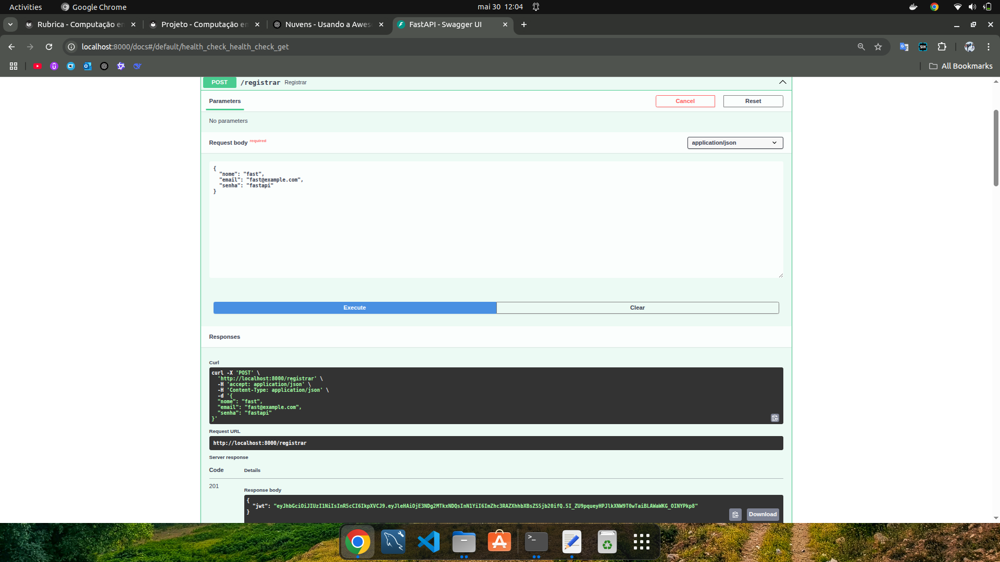
/// caption
Endpoint de cadastro.
///
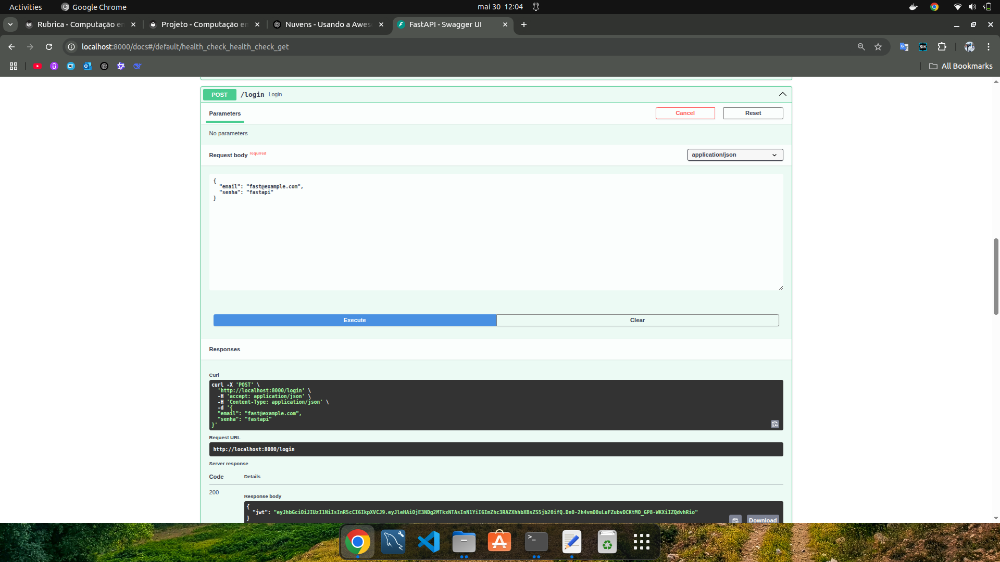
/// caption
Endpoint de login.
///
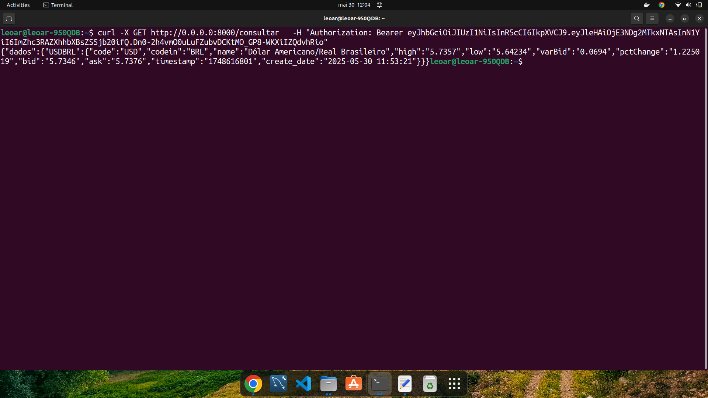
/// caption
Endpoint para consultar o scrap, que funciona apenas se o usuário tiver cadastro e token.
///
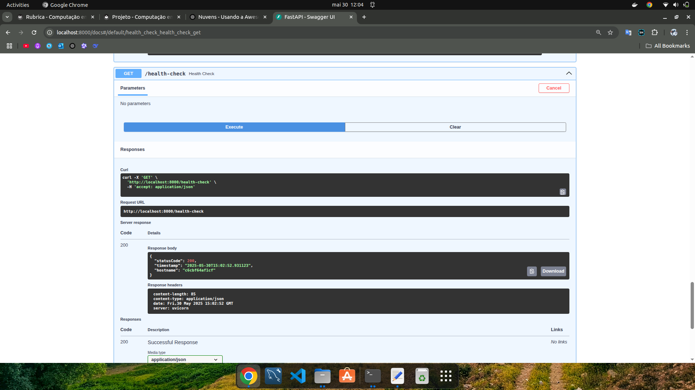
/// caption
Endpoint de health check.
///

## Vídeo de Execução da Aplicação

[Baixar/Ver vídeo (.webm)](./video/FastAPI_Nuvens.webm)

## Link Para o Docker Hub do Projeto

Clique [aqui](https://hub.docker.com/r/arthurec/projeto01-nuvens) para abrir o o link do Docker Hub.

## Compose Final

O arquivo *compose.yaml* está na raíz do projeto. Seu conteúdo é o seguinte:

**Arquivo:** `compose.yaml` 

```yaml
services:
  api:
    image: arthurec/projeto01-nuvens
    env_file: .env
    restart: always
    ports:
      - "8000:8000"
    depends_on:
      - db

  db:
    image: postgres:latest
    hostname: db
    environment:
      POSTGRES_USER: ${DATABASE_USER:-projeto}
      POSTGRES_PASSWORD: ${DATABASE_PASSWORD:-projeto}
      POSTGRES_DB: ${DATABASE_NAME:-projeto}
```


# Entrega 2

#### **Projeto FastAPI no AWS Lightsail**

A parte 2 do projeto consiste em:

- Implantar a API utilizando o AWS Lightsail Container Service.
- Configurar o PostgreSQL no Lightsail.
- Conectar a aplicação ao banco de dados.
- Gerenciar e monitorar o custo do serviço em produção. (Nesse projeto o limite de gasto por mês é de 50 dólares)

Antes de iniciar o grupo teve que certificar que:

- Conta ativa na AWS com acesso ao Lightsail.
- Docker instalado e configurado.
- Código da aplicação FastAPI pronto e funcional localmente.

## Screenshots dos Endpoints funcionando no AWS:

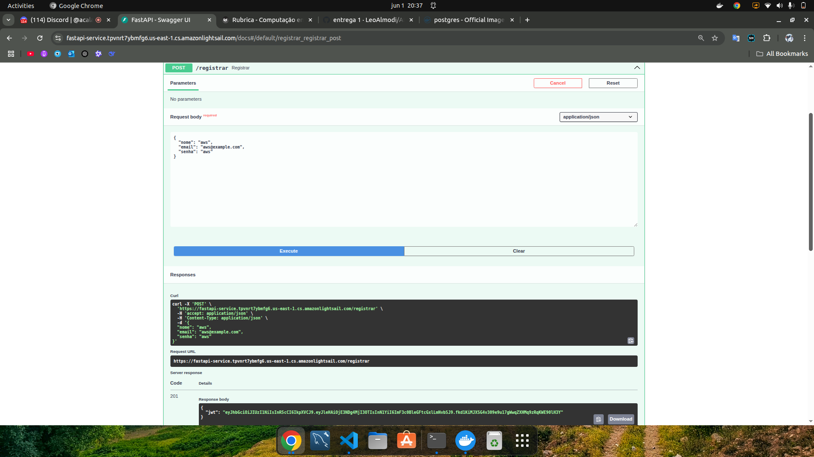
/// caption
Endpoint de cadastro.
///
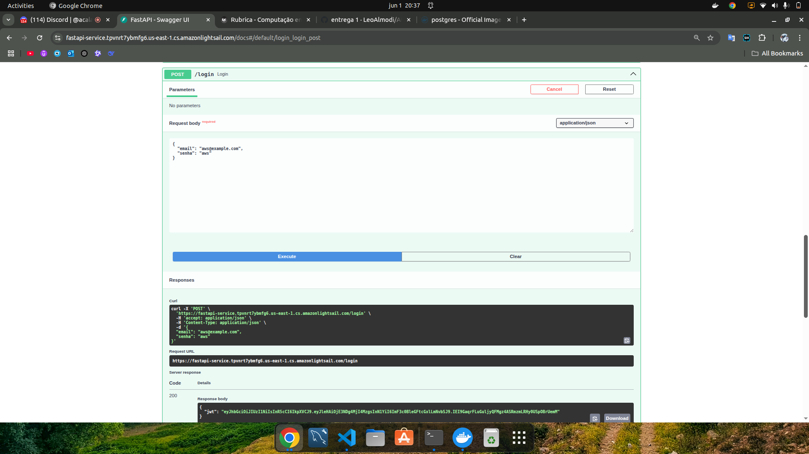
/// caption
Endpoint de login.
///
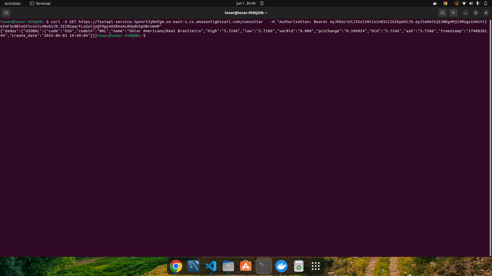
/// caption
Endpoint para consultar o scrap, que funciona apenas se o usuário tiver cadastro e token.
///
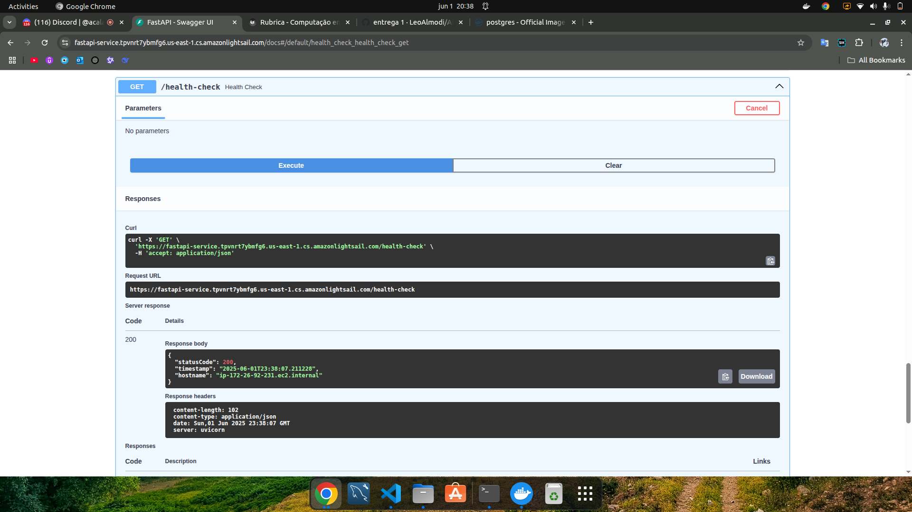
/// caption
Endpoint de health check.
/// 

## Screenshot de infraestrutura na AWS:

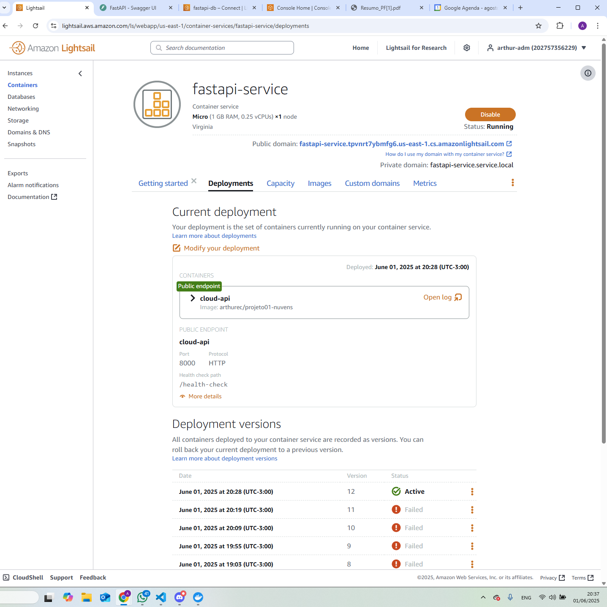
/// caption
Infraestrutura API.
/// 

/// caption
Infraestrutura DB.
/// 
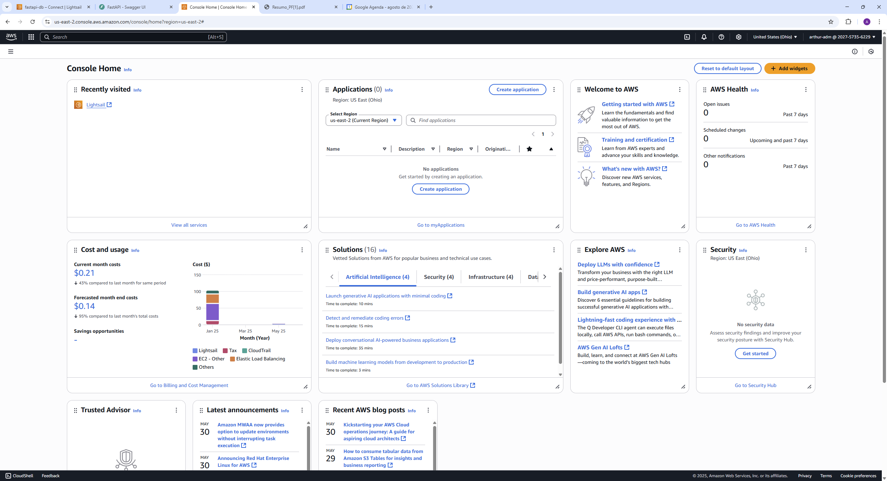
/// caption
Infraestrutura.
/// 

## Screenshot do custo no dia eda submissão dos documentos:

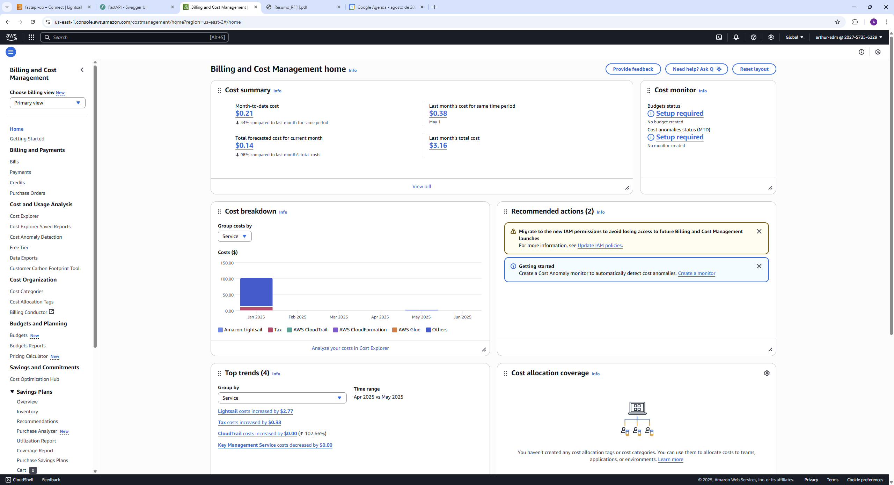
/// caption
Tela dos custos.
/// 

## Vídeo de execução da aplicação funcionando no Ligthsail.

[Baixar/Ver vídeo (.webm)](./video/P_E2.webm)

