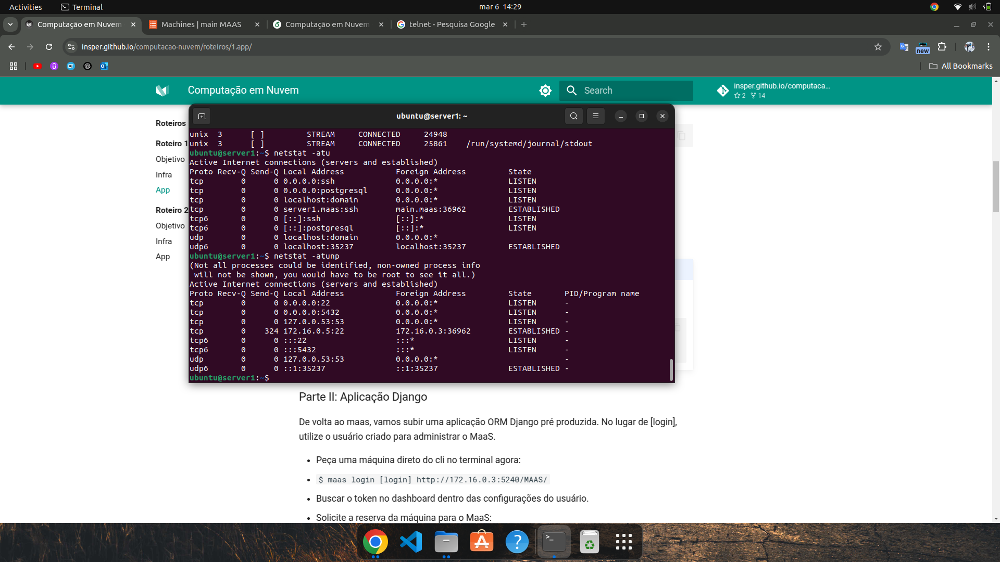
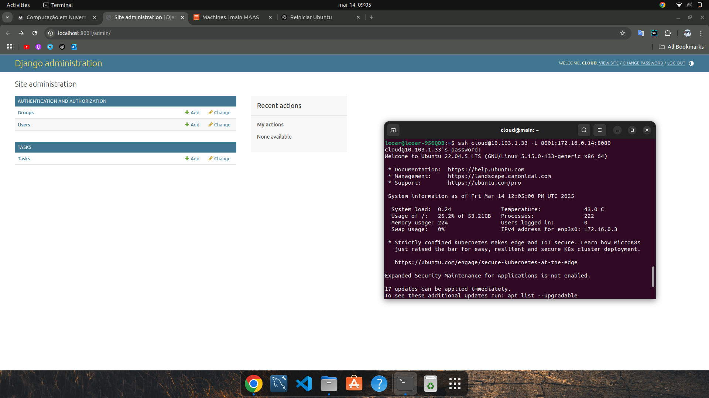

## Objetivo

Entender os conceitos básicos sobre uma plataforma de gerenciamento de hardware e introduzir conceitos básicos sobre redes de computadores.

## Montagem do Roteiro

Os pontos "tarefas" são os passos que devem ser seguidos para a realização do roteiro. Eles devem ser claros e objetivos. Com evidências claras de que foram realizados.

### Instalando o MAAS

<!-- termynal -->

``` bash
sudo snap install maas --channel=3.5/Stable
```


/// caption
Dashboard do MAAS
///

Conforme ilustrado acima, a tela inicial do MAAS apresenta um dashboard com informações sobre o estado atual dos servidores gerenciados. O dashboard é composto por diversos painéis, cada um exibindo informações sobre um aspecto específico do ambiente gerenciado. Os painéis podem ser configurados e personalizados de acordo com as necessidades do usuário.

### Configurando o MAAS

Inicializando o MaaS:
<!-- termynal -->

``` bash
sudo maas init region+rack --maas-url http://172.16.0.3:5240/MAAS --database-uri maas-test-db:///
sudo maas createadmin
```

Gerando um par de chaves para autenticação.
<!-- termynal -->

``` bash
ssh-keygen -t rsa
cat ./.ssh/id_rsa.pub
```

#### Chaveando o DHCP

Foi habilitado o DHCP na subrede pelo MaaS Controller, e então, alterado o Reserved Range.

Após isso, o DNS da subnet foi apontado para o DNS da rede externa, e por fim, desabilitado o DHCP do roteador.


#### Checando saúde do MAAS

Confirmamos a saúde do sistema MAAS visitando a página Controladores na interface web (dashboard).

#### Comissionando servidores 

Nessa etapa, cadastramos os hosts (machines) disponíveis, server 1 até server 5. 

Para cada máquina, fizemos a seguinte etapa.

- Alteramos a opção *Power Type* para *Intel AMT*
- Colocamos o MacAddress da máquina
- Colocamos a senha 
- Por fim, o IP do AMT.

E no final, também adicionamos o Roteador como devices no dashboard do MaaS.

#### Criando OVS bridge

Uma Open vSwitch (OVS) bridge reduz a necessidade de duas interfaces de rede físicas.

O nome da ponte será referenciado em outras partes dos roteiros, chamaremos de "br-ex".

Será feito isso para todos os hosts.


## App


### Tarefa 1
Após instalar o postgresql no server 1, iremos testar algumas coisas.


/// 
Funcionando e seu Status está como "Ativo" para o Sistema Operacional
///

///
Acessivel na própria maquina na qual ele foi implantado.
///

///
Acessivel a partir de uma conexão vinda da máquina MAIN.
///

///
Verfificando em qual porta este serviço está funcionando.
///

### Tarefa 2

Agora iremos instalar no server 2 o Django manualmente.


### Tarefa 3


///
Aqui está o Django do servidor 2 funcionando
///


Primeiramente, duas máquinas (server 1 e server 2) foram alocadas, e em seguida o grupo deu deploy em ambas com a imagem do ubuntu 22.04 LTS.
Após isso, dentro do server 1, foi instalado o postgreSQL, criado um usuario para a aplicação, e, então, criado um database chamado tasks. Depois disso, dois arquivos foram mudados (postgresql.conf e pg_hba.conf), para expor o serviço para acesso e deixar liberado para qualquer máquina dentro da subnet do kit. No fim, foi liberado o firewall e reinicidado o serviço.
No server 2, foi clonado um repositório de instalação do django, e foi rodado o script de instalação. Após a instalação foi configurado que o banco de dados seja o criado no server 1. Logo depois, foi dado reboot do server, adicionado o IPV4 do server1 no /etc/hosts e testado o acesso do serviço pela porta 8080 no terminal do MaaS.

### Tarefa 4

Também foi instalado no server 3 a aplicação Django, porém utilizando a ferramenta Ansible.


A diferença entre instalar o Django manualmente e utilizando o Ansible está na forma como os comandos são executados. Na instalação manual, cada comando precisa ser digitado e executado individualmente, tornando o processo mais demorado e suscetível a erros. Já com o Ansible, todas as etapas da instalação são definidas em um playbook YAML, permitindo que a configuração seja aplicada automaticamente e de forma padronizada. Isso torna o processo mais eficiente, reprodutível e escalável, especialmente em ambientes com múltiplos servidores.

### Tarefa 5
Para montar o ponto único de entrada, utilizaremos uma aplicação de proxy reverso como load balancer. Será instalado no server 4.


## Questionário, Projeto ou Plano

Esse seção deve ser preenchida apenas se houver demanda do roteiro.

## Discussões

Quais as dificuldades encontradas? O que foi mais fácil? O que foi mais difícil?

## Conclusão

O que foi possível concluir com a realização do roteiro?
