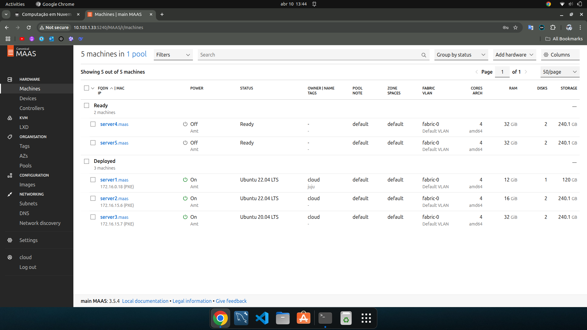
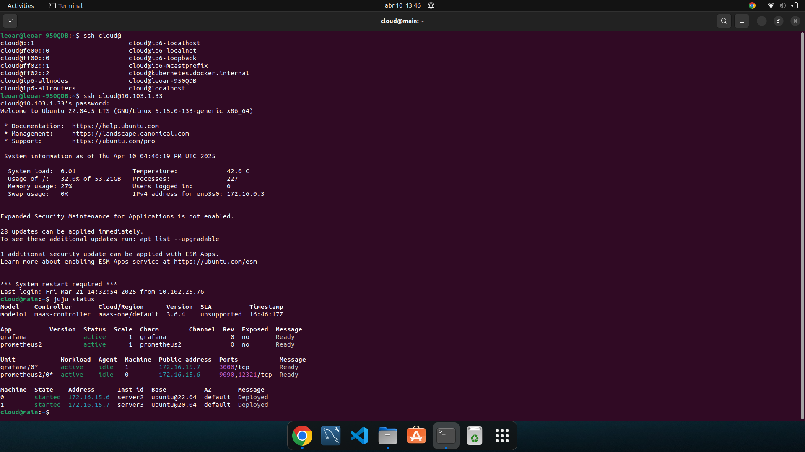
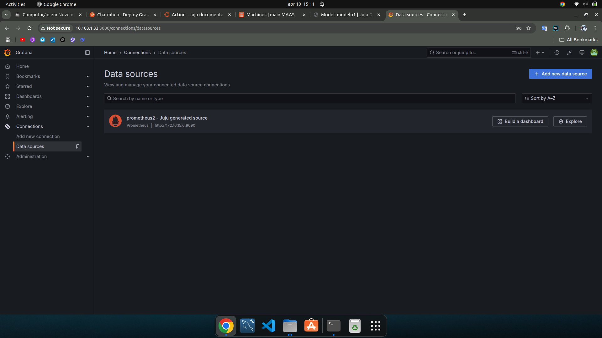
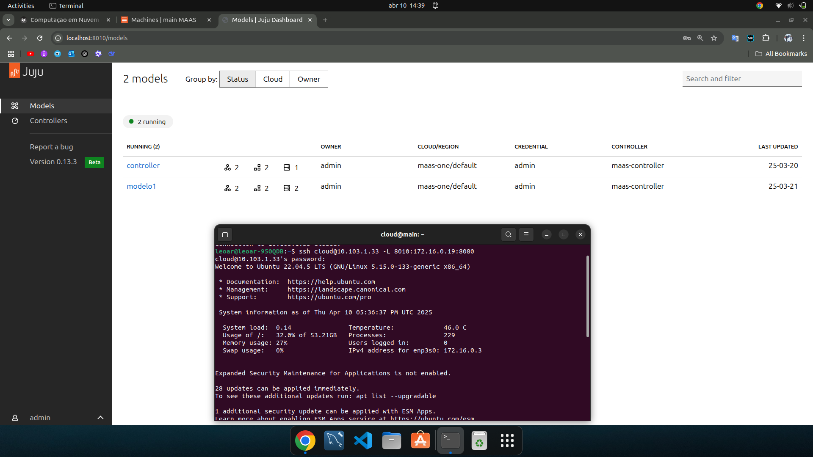
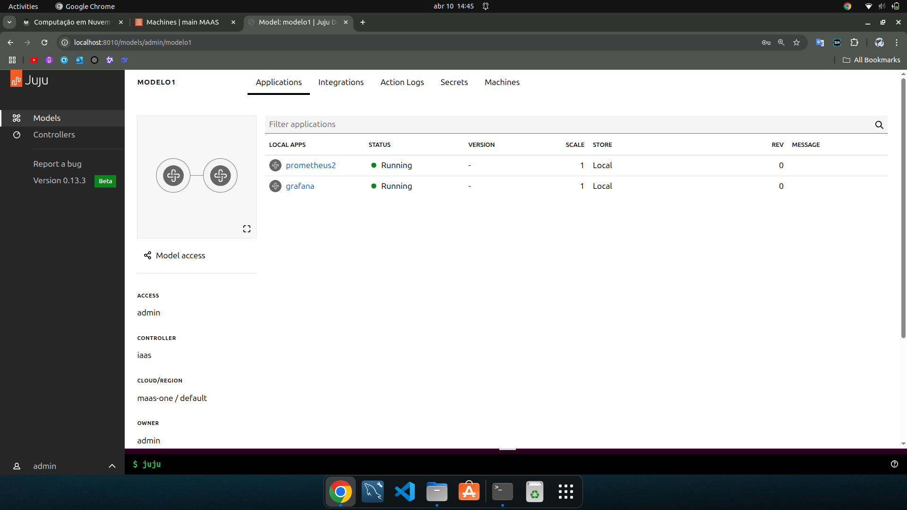

## Objetivo

- Entender os conceitos básicos sobre uma plataforma de gerenciamento de aplicações distribuídas.
- Entender os conceitos básicos de comunicação entre aplicações e serviços.

#### Pré-requisitos

- Ter o Bare Metal feito (roteiro anterior)

## Criando Infraestrutura para deploy com Juju

Para montar a nossa Cloud Privada, vamos utilizar um orquestrador de deploy que integra com o MaaS. Primeiramente, temos que verificar 
se todas as máquinas estão ready.

Após isso, o Juju deve ser instalado no main:

<!-- termynal -->

``` bash
sudo snap install juju --channel 3.6
```

Com o Juju instalado, devemos criar dois arquivos:

- Criar um arquivo de configuração _maas-cloud.yaml_, e depois de salvar, rodar o seguinte comando:
    <!-- termynal -->
``` bash
$ juju add-cloud --client -f maas-cloud.yaml maas-one
```

- Criar um arquivo de credenciais _maas-creds.yaml_, e depois de salvar, rodar o seguinte comando:
    <!-- termynal -->
``` bash
$ juju add-credential --client -f maas-creds.yaml maas-one
```

Iremos criar o controlador no server1 para isso faça a tag da maquina com o nome juju através do dashboard MAAS na maquina server1.

<!-- termynal -->
``` bash
juju bootstrap --bootstrap-series=jammy --constraints tags=juju maas-one maas-controller
```


## App

### Instalando o Dashboard do JUJU para o controlador principal (controller)


<!-- termynal -->
``` bash
juju switch controller
juju deploy juju-dashboard dashboard --to lxd:0
juju integrate dashboard controller
juju expose dashboard
juju dashboard
```

Após a instalação do Dashboard, rodamos os seguintes comandos:

<!-- termynal -->
``` bash
juju switch maas-controller:admin/maas
```
 
### Fazendo o deploy da Aplicação Grafana e Prometheus 

#### Deploy Grafana e Prometheus

- Criamos uma pasta chamada charms para baixar o charm do Grafana e do Prometheus do repositório charm-hub.

<!-- termynal -->
``` bash
mkdir -p /home/cloud/charms
cd /home/cloud/charms
```

- Baixamos o charm do https://charmhub.io/grafana usando o comando juju download.

<!-- termynal -->
``` bash
juju download grafana
```

- Também vamos utilizar o charm do Prometheus

<!-- termynal -->
``` bash
juju download prometheus2
```

- Agora demos o deploy de ambas aplicações

<!-- termynal -->
``` bash
juju deploy ./prometheus2_r60.charm
juju deploy ./grafana_r69.charm --series focal
```
- Por último, fizemos a integração dessas duas aplicações

<!-- termynal -->
``` bash
juju integrate grafana:grafana-source prometheus2:grafana-source
```

### Tarefa 1


/// caption
Dashboard do MAAS com as Maquinas e seus respectivos IPs.
///

/// caption
Tela do comando "juju status" depois que o Grafana estiver "active".
///

/// caption
Dashboard do Grafana com o Prometheus aparecendo como source.
/// 

/// caption
Dashboard a partir da rede do Insper.
///

/// caption
Aplicações sendo gerenciadas pelo JUJU
///
