## Objetivo

- Entender os conceitos básicos de Private Cloud.
- Aprofundar conceitos sobre redes virtuais SDN.

#### Pré-requisitos

- Terminar de Ler o capítulo [Juju](https://documentation.ubuntu.com/juju/3.6/reference/juju-cli/).
- Realizar a leitura sobre o Openstack.
    - <https://www.openstack.org/>
    - <https://www.openstack.org/software/>
    - <https://ubuntu.com/openstack/what-is-openstack>
- Realizar a leitura sobre o Openstack. [Jackson et al - Cap. 1 até Cap. 5].


## Infraestrutura

Nesse roteiro vamos instalar um conjunto de aplicações denominado Openstack que vai permitir distribuirmos virtual machines usando os nós disponíveis no kit.

Até o momento usamos o MAAS para orquestrar o bare metal e o juju para cuidar do deployment de aplicações (exemplo grafana e prometheus). Agora, vamos utilizar o Openstack para criar VMs e distribuir os serviços em todas as máquinas kit com maior eficiência.

### 1. Instalando o Juju Controller

Adicionar a tag controller na máquina server1:

``` bash
juju bootstrap --bootstrap-series=jammy --constraints tags=controller maas-one maas-controller
```

### 2. Definindo o modelo de deploy

``` bash
juju add-model --config default-series=jammy openstack
juju switch maas-controller:openstack
```

### 3. Ceph OSD

**Arquivo:** `ceph-osd.yaml`

```yaml
ceph-osd:
  osd-devices: /dev/sda /dev/sdb
```
``` bash
juju deploy -n 3 --channel quincy/stable --config ceph-osd.yaml --constraints tags=compute ceph-osd
```

### 4. Nova Compute

**Arquivo:** `nova-compute.yaml`    

```yaml
nova-compute:
  config-flags: default_ephemeral_format=ext4
  enable-live-migration: true
  enable-resize: true
  migration-auth-type: ssh
  virt-type: qemu
```

``` bash
juju deploy -n 3 --to 0,1,2 --channel yoga/stable --config nova-compute.yaml nova-compute
```

### 5. MySQL InnoDB Cluster

``` bash
juju deploy -n 3 --to lxd:0,lxd:1,lxd:2 --channel 8.0/stable mysql-innodb-cluster
```

### 6. Vault

``` bash
juju deploy --to lxd:2 vault --channel 1.8/stable
```

``` bash
juju deploy --channel 8.0/stable mysql-router vault-mysql-router
juju integrate vault-mysql-router:db-router mysql-innodb-cluster:db-router
juju integrate vault-mysql-router:shared-db vault:shared-db
```

!!! info "Unseal"
    Vault must now be initialised and unsealed. The vault charm will also need to be authorised to carry out certain tasks. These steps are covered in the [vault charm documentation](https://opendev.org/openstack/charm-vault/src/branch/stable/1.8/src/README.md#post-deployment-tasks). Perform them **NOW**.

!!! info "CA Certificate (Self-signed)"
    Provide Vault with a CA certificate, we need to generate a self-signed CA certificate, so it can issue certificates to cloud API services. This is covered on the [Managing TLS certificates](https://docs.openstack.org/charm-guide/latest/admin/security/tls.html#add-ca-certificate) page. Do this now.

    ```bash
    juju run vault/leader generate-root-ca
    ```

Cloud applications are TLS-enabled via the vault:certificates relation. Below we start with the cloud database. Although the latter has a self-signed certificate, it is recommended to use the one signed by Vault’s CA:
```bash
juju integrate mysql-innodb-cluster:certificates vault:certificates
```

### 7. Neutron Networking

**Arquivo:** `neutron.yaml` 

```yaml
ovn-chassis:
  bridge-interface-mappings: br-ex:eth0
  ovn-bridge-mappings: physnet1:br-ex
neutron-api:
  neutron-security-groups: true
  flat-network-providers: physnet1
```

```bash
juju deploy -n 3 --to lxd:0,lxd:1,lxd:2 --channel 22.03/stable ovn-central
```

```bash
juju deploy --to lxd:1 --channel yoga/stable --config neutron.yaml neutron-api
```

```bash
juju deploy --channel yoga/stable neutron-api-plugin-ovn
juju deploy --channel 22.03/stable --config neutron.yaml ovn-chassis
```

```bash
juju integrate neutron-api-plugin-ovn:neutron-plugin neutron-api:neutron-plugin-api-subordinate
juju integrate neutron-api-plugin-ovn:ovsdb-cms ovn-central:ovsdb-cms
juju integrate ovn-chassis:ovsdb ovn-central:ovsdb
juju integrate ovn-chassis:nova-compute nova-compute:neutron-plugin
juju integrate neutron-api:certificates vault:certificates
juju integrate neutron-api-plugin-ovn:certificates vault:certificates
juju integrate ovn-central:certificates vault:certificates
juju integrate ovn-chassis:certificates vault:certificates
```

```bash
juju deploy --channel 8.0/stable mysql-router neutron-api-mysql-router
juju integrate neutron-api-mysql-router:db-router mysql-innodb-cluster:db-router
juju integrate neutron-api-mysql-router:shared-db neutron-api:shared-db
```

### 8. Keystone

```bash
juju deploy --to lxd:0 --channel yoga/stable keystone
```

```bash
juju deploy --channel 8.0/stable mysql-router keystone-mysql-router
juju integrate keystone-mysql-router:db-router mysql-innodb-cluster:db-router
juju integrate keystone-mysql-router:shared-db keystone:shared-db
```

```bash
juju integrate keystone:identity-service neutron-api:identity-service
juju integrate keystone:certificates vault:certificates
```

### 9. RabbitMQ

```bash
juju deploy --to lxd:2 --channel 3.9/stable rabbitmq-server
```

```bash
juju integrate rabbitmq-server:amqp neutron-api:amqp
juju integrate rabbitmq-server:amqp nova-compute:amqp
```


### 10. Nova Cloud Controller

**Arquivo:** `ncc.yaml` 

```yaml
nova-cloud-controller:
  network-manager: Neutron
```

```bash
juju deploy --to lxd:2 --channel yoga/stable --config ncc.yaml nova-cloud-controller
```

```bash
juju deploy --channel 8.0/stable mysql-router ncc-mysql-router
juju integrate ncc-mysql-router:db-router mysql-innodb-cluster:db-router
juju integrate ncc-mysql-router:shared-db nova-cloud-controller:shared-db
```

```bash
juju integrate nova-cloud-controller:identity-service keystone:identity-service
juju integrate nova-cloud-controller:amqp rabbitmq-server:amqp
juju integrate nova-cloud-controller:neutron-api neutron-api:neutron-api
juju integrate nova-cloud-controller:cloud-compute nova-compute:cloud-compute
juju integrate nova-cloud-controller:certificates vault:certificates
```

### 11. Placement

```bash
juju deploy --to lxd:2 --channel yoga/stable placement
```

```bash
juju deploy --channel 8.0/stable mysql-router placement-mysql-router
juju integrate placement-mysql-router:db-router mysql-innodb-cluster:db-router
juju integrate placement-mysql-router:shared-db placement:shared-db
```

```bash
juju integrate placement:identity-service keystone:identity-service
juju integrate placement:placement nova-cloud-controller:placement
juju integrate placement:certificates vault:certificates
```

### 12. Horizon - OpenStack Dashboard

```bash
juju deploy --to lxd:2 --channel yoga/stable openstack-dashboard
```

```bash
juju deploy --channel 8.0/stable mysql-router dashboard-mysql-router
juju integrate dashboard-mysql-router:db-router mysql-innodb-cluster:db-router
juju integrate dashboard-mysql-router:shared-db openstack-dashboard:shared-db
```

```bash
juju integrate openstack-dashboard:identity-service keystone:identity-service
juju integrate openstack-dashboard:certificates vault:certificates
```

### 13. Glance

```bash
juju deploy --to lxd:2 --channel yoga/stable glance
```

```bash
juju deploy --channel 8.0/stable mysql-router glance-mysql-router
juju integrate glance-mysql-router:db-router mysql-innodb-cluster:db-router
juju integrate glance-mysql-router:shared-db glance:shared-db
```

```bash
juju integrate glance:image-service nova-cloud-controller:image-service
juju integrate glance:image-service nova-compute:image-service
juju integrate glance:identity-service keystone:identity-service
juju integrate glance:certificates vault:certificates
```

### 14. Ceph Monitor

**Arquivo:** `ceph-mon.yaml` 

```yaml
ceph-mon:
  expected-osd-count: 3
  monitor-count: 3
```

```bash
juju deploy -n 3 --to lxd:0,lxd:1,lxd:2 --channel quincy/stable --config ceph-mon.yaml ceph-mon
```

```bash
juju integrate ceph-mon:osd ceph-osd:mon
juju integrate ceph-mon:client nova-compute:ceph
juju integrate ceph-mon:client glance:ceph
```

### 15. Cinder

**Arquivo:** `cinder.yaml` 

```yaml
cinder:
  block-device: None
  glance-api-version: 2
```

```bash
juju deploy --to lxd:1 --channel yoga/stable --config cinder.yaml cinder
```

```bash
juju deploy --channel 8.0/stable mysql-router cinder-mysql-router
juju integrate cinder-mysql-router:db-router mysql-innodb-cluster:db-router
juju integrate cinder-mysql-router:shared-db cinder:shared-db
```

```bash
juju integrate cinder:cinder-volume-service nova-cloud-controller:cinder-volume-service
juju integrate cinder:identity-service keystone:identity-service
juju integrate cinder:amqp rabbitmq-server:amqp
juju integrate cinder:image-service glance:image-service
juju integrate cinder:certificates vault:certificates 
```

```bash
juju deploy --channel yoga/stable cinder-ceph
```

```bash
juju integrate cinder-ceph:storage-backend cinder:storage-backend
juju integrate cinder-ceph:ceph ceph-mon:client
juju integrate cinder-ceph:ceph-access nova-compute:ceph-access
```

### 16. Ceph RADOS Gateway

```bash
juju deploy --to lxd:0 --channel quincy/stable ceph-radosgw
```

```bash
juju integrate ceph-radosgw:mon ceph-mon:radosgw
```

### 17. Ceph-OSD Integration

!!! info "Atenção!!!"
    Execute o comando abaixo apenas se você estiver certeza de que todos os procedimentos anteriores foram realizados com sucesso.

    ```bash
    juju config ceph-osd osd-devices='/dev/sdb'
    ```


At this time the Unit section output to command juju status should look similar to this:


## Setup


Chegou a hora de configurar os serviços que controlam:

- as VMs (Nova);
- os volumes de disco (Cinder), e;
- a estrutura de rede virtual (Neutron).

Para isso, é preciso:

1. Carregar as variáveis de ambiente e se autenticar (Keystone) no sistema - openrc;
1. Utilizar o dashboard (Horizon) para visualizar as mudanças que estão sendo feitas;
1. Importar uma imagem do Ubuntu Jammy para o Glance (servidor de imagens);
1. Criar os flavors (instance type) para as VMs;
1. Criar uma rede externa (subnet) para conectar as VMs à rede física;
1. Criar uma rede interna (subnet) e um roteador (router) para conectar as VMs à rede externa.


### 1. Passo 1: Autenticação

Crie, download, o arquivo openrc com as credenciais de acesso ao OpenStack. O arquivo deve conter as seguintes variáveis de credenciais para o OpenStack.

### 2. Passo 2: Horizon

Acesse o Horizon (dashboard) como administrador e mantenha ele aberto durante todo o setup do openstack (para ver as mudanças acontecendo!).

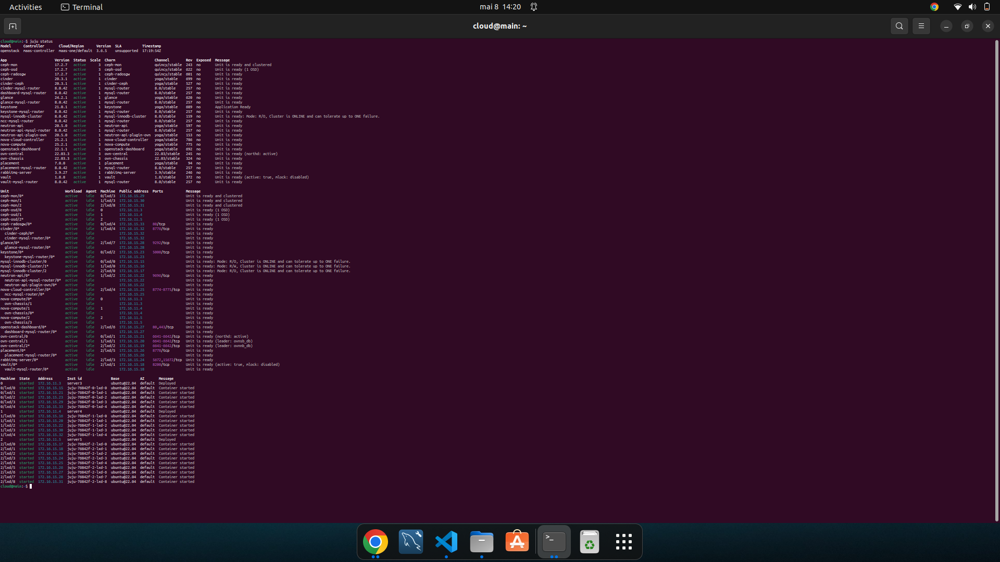
/// caption
Status do JUJU.
///

/// caption
Dashboard do *MAAS* com as máquinas.
///
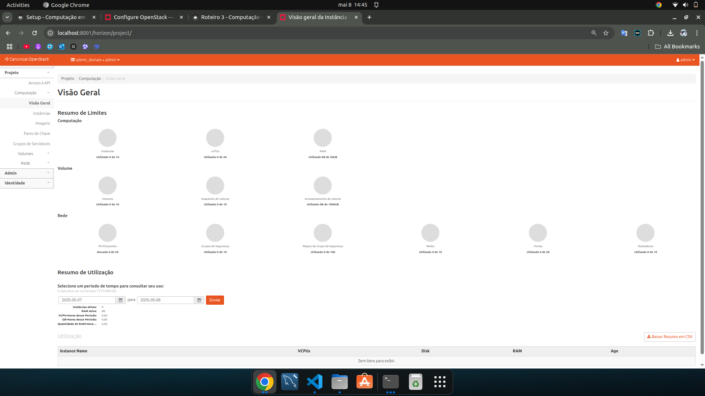
/// caption
Aba compute overview no *OpenStack* Dashboard.
///
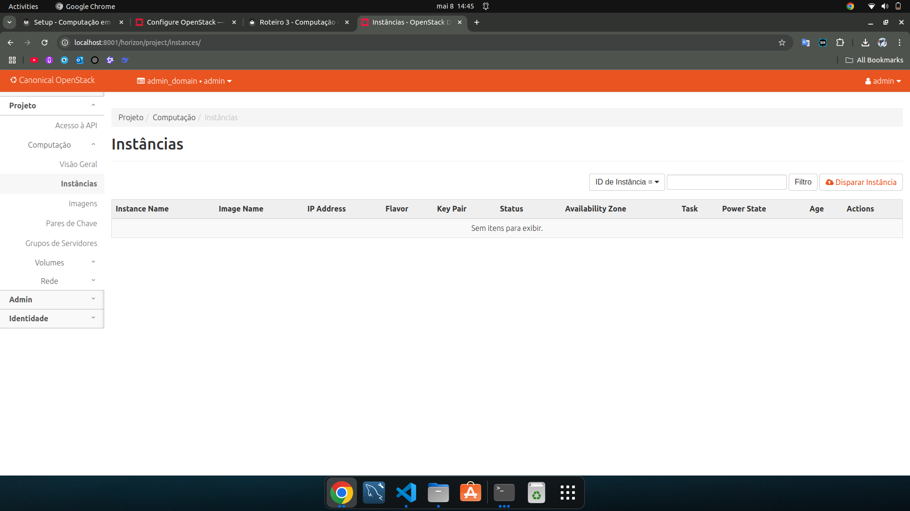
/// caption
Aba compute instances no *OpenStack* Dashboard.
///
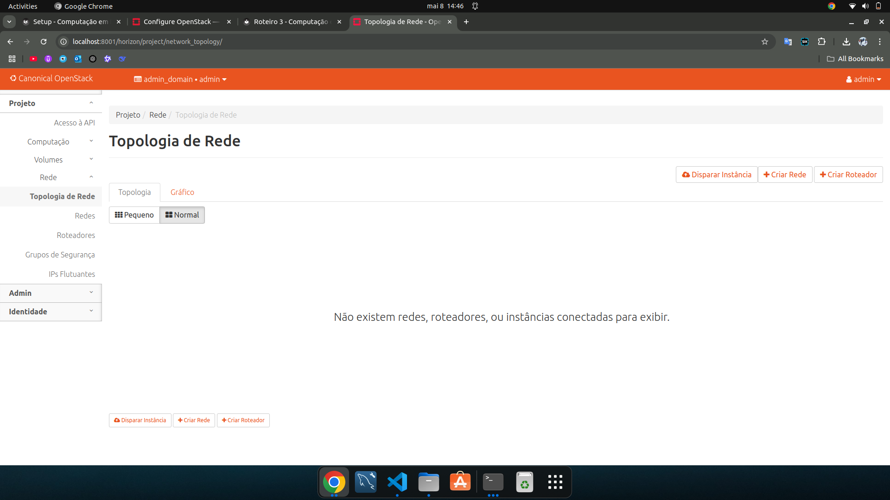
/// caption
Aba network topology no *OpenStack* Dashboard.
///

### 3. Passo 3: Imagens e Flavors

Usando a documentação oficial, faça o seguinte:

- Instale o client do Openstack no main via snap.

```bash
sudo snap install openstackclients
```

- Carregue as credenciais em openrc: 

```bash
source ~/openrc
```

- Verifique os serviços disponíveis no Openstack:

```bash
openstack service list
```

- Faça pequenos ajustes na rede:

```bash
juju config neutron-api enable-ml2-dns="true"
juju config neutron-api-plugin-ovn dns-servers="172.16.0.1"
```

- Importe a imagem do Ubuntu Jammy. Você precisará procurar esta imagem.

- Analise o comando:

```bash
openstack flavor create --help
```

- Crie os flavors (instance type) - SEM ephemeral disk:

| Flavor Name | vCPUs | RAM (GB) | Disk |
|-------------|:-----:|:--------:|-----:|
| m1.tiny     |   1   |     1    |  20  |
| m1.small    |   1   |     2    |  20  |
| m1.medium   |   2   |     4    |  20  |
| m1.large    |   4   |     8    |  20  |


### 4. Passo 4: Rede Externa

- Configure a rede externa. Usar uma faixa de alocação entre 172.16.7.0 e 172.16.8.255.

```bash
openstack network create --external --share \
   --provider-network-type flat --provider-physical-network physnet1 \
   ext_net
```

```bash
openstack subnet create --network ext_net --no-dhcp \
   --gateway 172.16.0.1 --subnet-range 172.16.0.0/20 \
   --allocation-pool start=172.16.7.0,end=172.16.8.255 \
   ext_subnet
```
### 5. Passo 5: Rede Interna e Roteador

- Crie a rede interna e o roteador. Usar a subnet 192.169.0.0/24. Não use DNS.

```bash
openstack network create --internal user1_net

openstack subnet create --network user1_net \
   --subnet-range 192.169.0.0/24 \
   --allocation-pool start=192.169.0.10,end=192.169.0.90 \
   user1_subnet
```

```bash
openstack router create user1_router
openstack router add subnet user1_router user1_subnet
openstack router set user1_router --external-gateway ext_net
```

### 6. Passo 6: Conexão

- *Importe* (upload) um key-pair, usando public key (id_rsa.pub) da máquina onde está o MaaS.

```bash
openstack keypair create --public-key ~/.ssh/id_rsa.pub user1
```

```bash
openstack security group create --description 'Allow SSH' Allow_SSH
openstack security group rule create --proto tcp --dst-port 22 Allow_SSH
```

- Via o Horizon (dashboard), como administrador:

    - Adicione a liberação do _SSH_ e _ALL ICMP_ no security group default.
    - Verifique se a topologia de rede faz sentido. Ela deve ser semelhante ao projeto da sua rede física, porém com mais um nível dentro. *Atenção*: a rede não existe fisicamente, é tudo virtual.


### 7. Passo 7: Instância

- Dispare uma instância m1.tiny com o nome client e sem Novo Volume;

```bash
openstack server create --image jammy-amd64 --flavor m1.tiny    --key-name user1 --network user1_net --security-group Allow_SSH    client
```

- Aloque um floating IP para a instância;

```bash
FLOATING_IP=$(openstack floating ip create -f value -c floating_ip_address ext_net)
openstack server add floating ip client $FLOATING_IP
```

- Teste a conexão SSH! Em caso de erro, volte e verifique se as etapas anteriores estão corretas.

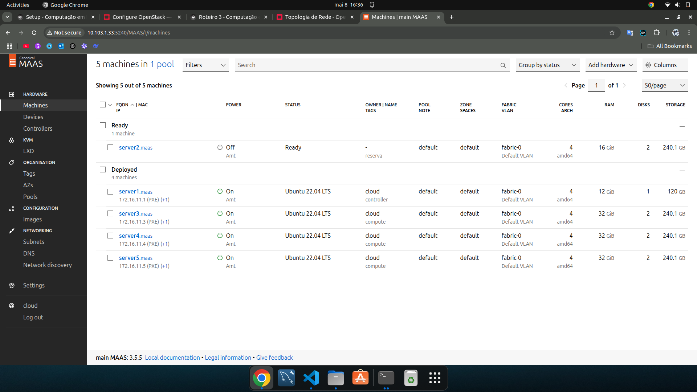
/// caption
Dashboard do *MAAS* com as máquinas.
///
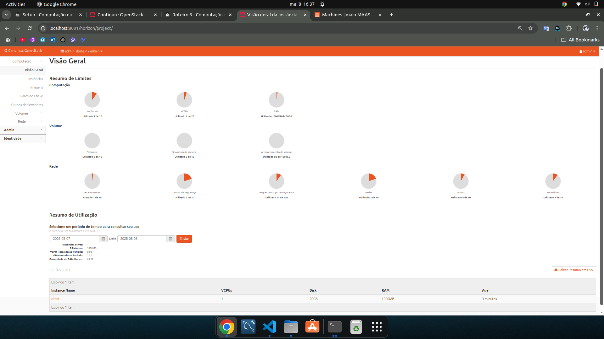
/// caption
Aba compute overview no *OpenStack*.
///
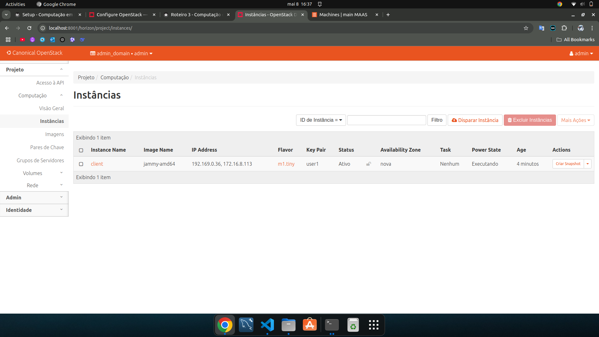
/// caption
Aba compute instances no *OpenStack*.
///
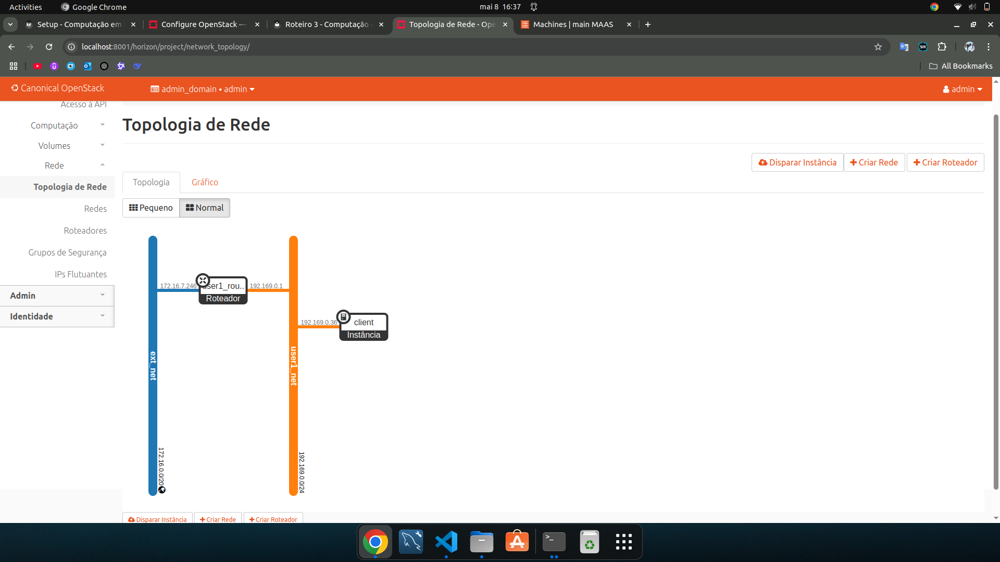
/// caption
Aba network topology no *OpenStack*.
///

1. Enquanto o Dashboard do MAAS não muda, após criar a instância, as abas _Compute Overview_, _Compute Instances_ e _Network Topology_ mostram as mudanças. No qual, quando não existia nenhuma instância, não aparecia nada em nenhuma das abas, e, agora, aparece a instância *client*, na topologia mostra o esquema da rede, e na aba de overview mostra a visão geral de tudo.


### Escalando os nós


No OpenStack, escalar os nós de configuração é essencial para melhorar a capacidade, a resiliência e o desempenho dos serviços em um ambiente de nuvem. Ao adicionar novos nós de computing e block storage, a infraestrutura ganha flexibilidade para lidar com o aumento de carga e a demanda por recursos.

Benefícios da Escala dos Nós de Configuração Aumento de Capacidade de Processamento: Ao escalar os nós de computing, é possível executar mais instâncias de máquinas virtuais (VMs) simultaneamente, o que permite atender a mais usuários e aplicações. Esse aumento de capacidade é fundamental para garantir o atendimento à demanda, especialmente em ambientes que precisam se adaptar rapidamente a flutuações de uso.

Alta Disponibilidade e Tolerância a Falhas: A distribuição de serviços críticos, como computing e block storage, em múltiplos nós contribui para uma arquitetura mais robusta. Com mais nós, falhas em uma máquina têm impacto reduzido no sistema geral, uma vez que as cargas podem ser automaticamente redirecionadas para outros nós ativos.

Melhoria de Desempenho e Latência Reduzida: Com mais nós de armazenamento e computação, os dados e os processos estão fisicamente mais próximos dos recursos e das VMs que os utilizam, reduzindo latências de acesso e melhorando a eficiência geral do sistema.

Escalabilidade Horizontal: Em vez de aumentar a capacidade de uma única máquina (escalabilidade vertical), adicionar novos nós permite uma escalabilidade horizontal, que é mais econômica e eficiente em termos de recursos, além de ser mais fácil de gerenciar. OpenStack é ideal para esse tipo de escalabilidade, pois os serviços de orquestração como Nova e Ceph distribuem automaticamente as cargas entre os novos nós.

Vamos adicionar o nó reserva ao openstack no cluster como nó de computing e block storage.

- Verfique no Dashboard do MaaS se ainda há uma máquina disponível (máquina que reservamos/allocated). Faça o release da máquina que está ALLOCATED (cuidado para não errar!)

- Instale o hypervisor, realizando o deploy na máquina:

```bash
juju add-unit nova-compute
```

- Anote o número da máquina adicionada no status e instale o block storage:

```bash
juju add-unit --to 3 ceph-osd
```

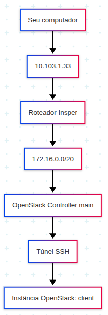
/// caption
Arquitetura de rede.
///

## App

**TAREFA**: Levantar as aplicações em máquinas virtuais do Openstack:

- 2 instâncias com a API do projeto, etapa 1;
- 1 instância com banco de dados, etapa 1, e;
- 1 instância com LoadBalancer, Nginx.

#### Etapas:

1. **Primeiro Passo**: Criar as instâncias e seus floating IPs.

2. **Segundo Passo**: LoadBalancer:

```bash
sudo apt update
sudo apt install nginx
```

```bash
sudo nano /etc/nginx/sites-available/default
```

Coloque as seguintes linhas:

  - upstream backend { server 172.16.8.234; server 172.16.7.4; }
  - location / { proxy_pass http://backend; }

```bash
sudo service nginx restart
```

3. **Terceiro Passo**: DataBase:


4. **Quarto Passo**: APIs:


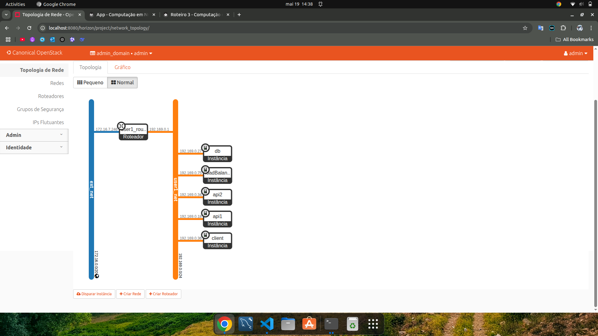
/// caption
Arquitetura de rede da infraestrutura dentro do Dashboard do Openstack.
///
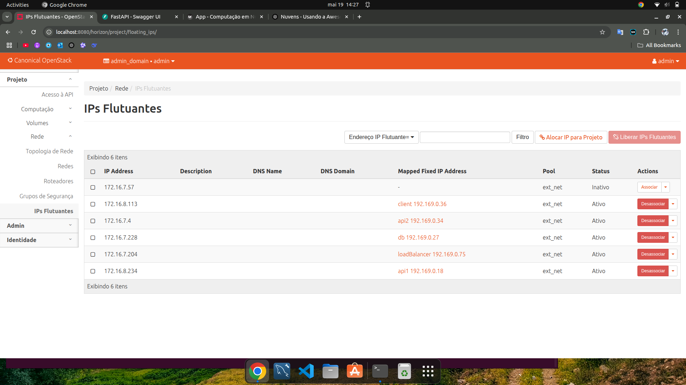
/// caption
Lista de VMs utilizadas com nome e IPs alocados.
///
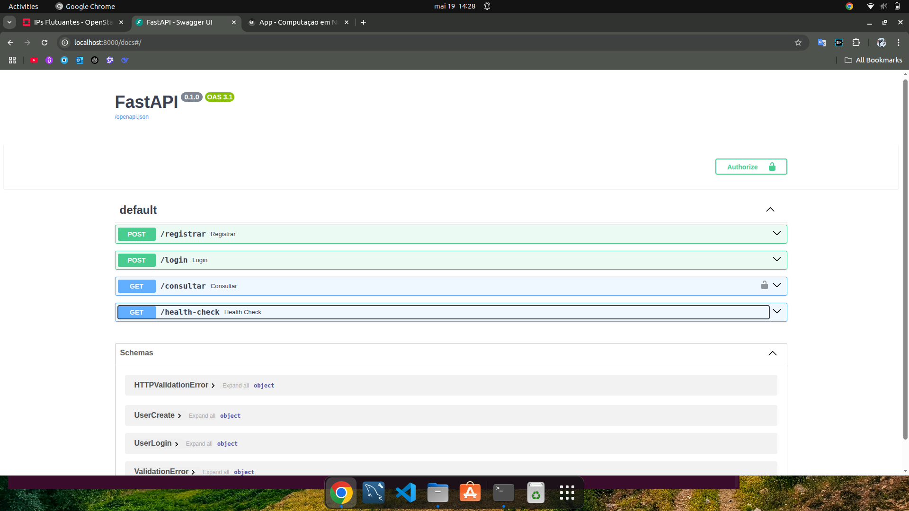
/// caption
Dashboard do FastAPI conectado via máquina Nginx/LB.
///
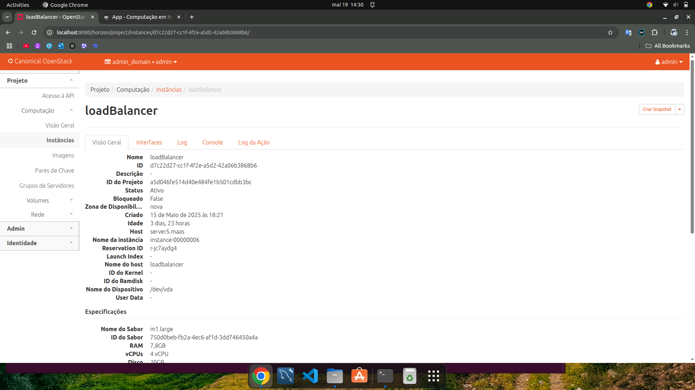
/// caption
Server (máquina física) que a instância load balancer foi alocada pelo OpenStack.
///

/// caption
Server (máquina física) que a instância api 1 foi alocada pelo OpenStack.
///
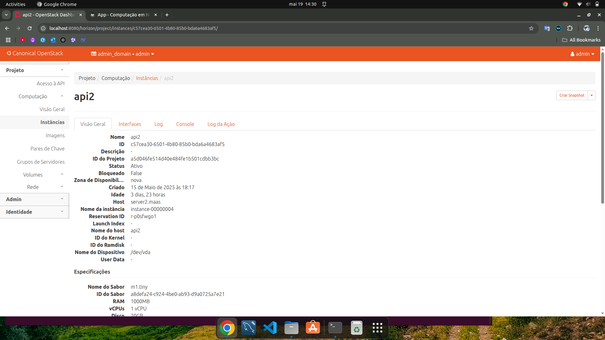
/// caption
Server (máquina física) que a instância api 2 foi alocada pelo OpenStack.
///
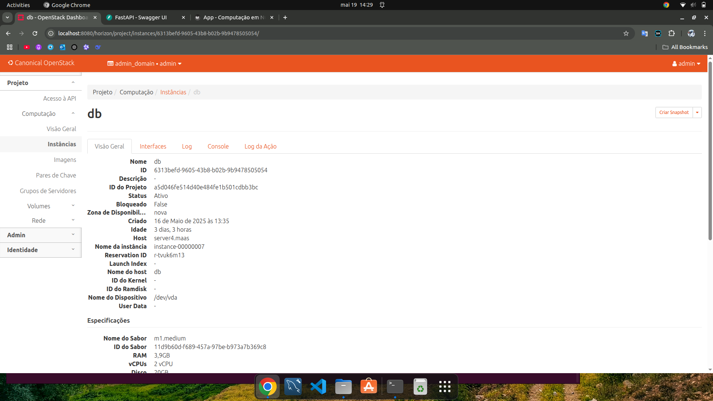
/// caption
Server (máquina física) que a instância db (database) foi alocada pelo OpenStack.
///

