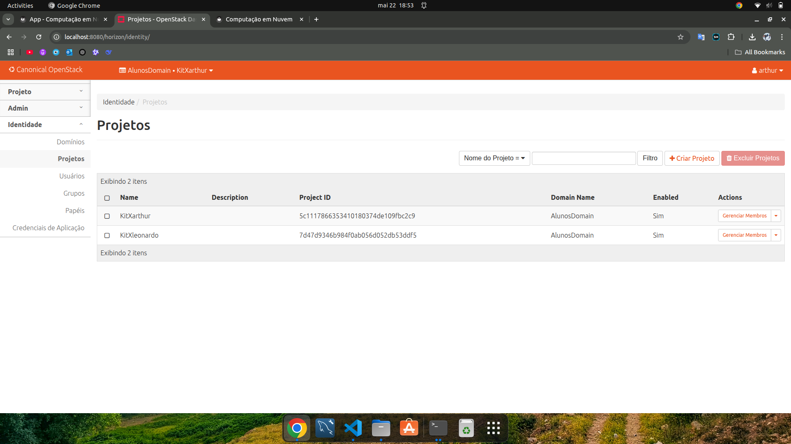
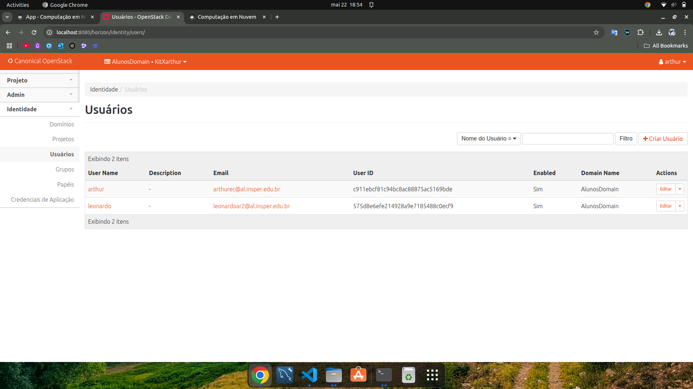
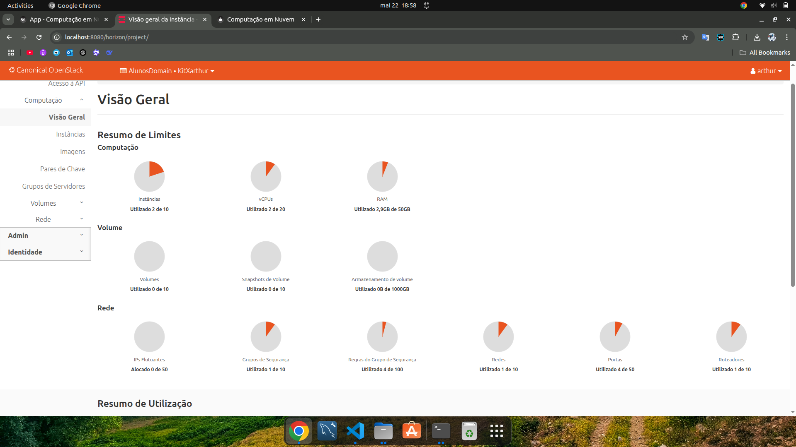
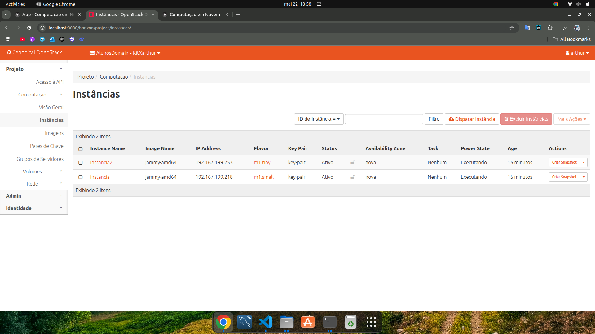
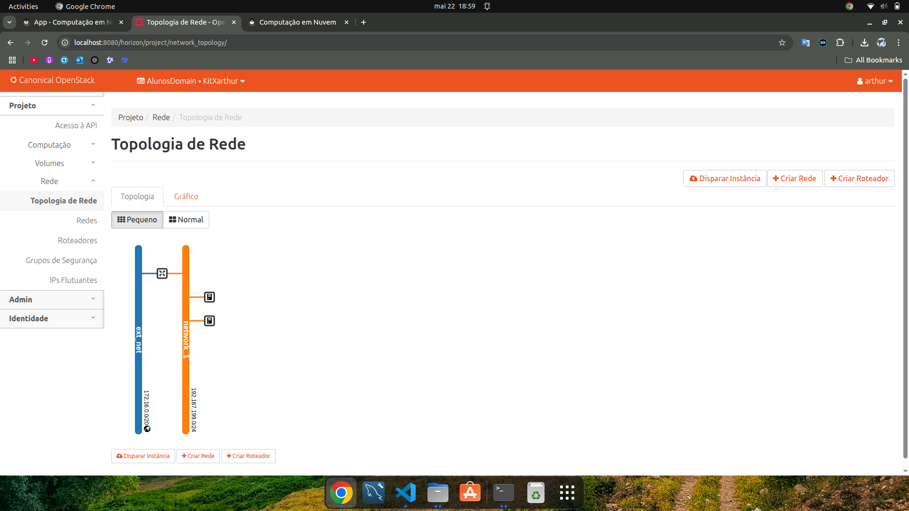
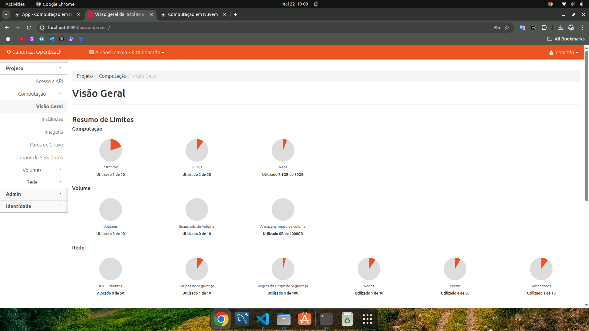
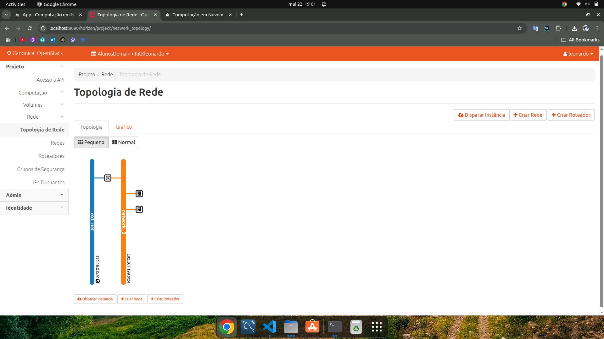

## Objetivo

- Entender os conceitos básicos Infraestrutura como código.
- Entender os conceitos básicos sobre SLA e DR.

#### Pré-requisitos

- Terminar o capítulo anterior (Openstack) Realizar a leitura [Kavis - Cap 11 e Cap 13]

### O que é Terraform em Infraestrutura como Código?

Terraform é a infraestrutura da HashiCorp como ferramenta de código. Ele permite que você defina recursos e infraestrutura em arquivos de configuração declarativos legíveis por humanos e gerencie o ciclo de vida de sua infraestrutura. O uso do Terraform tem várias vantagens em relação ao gerenciamento manual de sua infraestrutura:

1. O Terraform pode gerenciar a infraestrutura em várias plataformas de nuvem.
1. A linguagem de configuração legível por humanos ajuda você a escrever código de infraestrutura rapidamente.
1. O estado do Terraform permite rastrear alterações de recursos em todas as suas implantações.
1. Você pode confirmar suas configurações no controle de versão para colaborar com segurança na infraestrutura.

Para implantar infraestrutura com o Terraform:
```bash
* Scope         - Identifique a infraestrutura para o seu projeto.
* Author        - Escreva a configuração para sua infraestrutura.
* Initialize    - Instale os plugins que o Terraform precisa para gerenciar a infraestrutura.
* Plan          - Visualize as alterações que o Terraform fará para corresponder à sua configuração.
* Apply         - Faça as alterações planejadas.
```

### Instalar Terraform

Instalação do Terraform no Ubuntu/Debian:

- wget -O- https://apt.releases.hashicorp.com/gpg | gpg --dearmor | sudo tee /usr/share/keyrings/hashicorp-archive-keyring.gpg

- gpg --no-default-keyring --keyring /usr/share/keyrings/hashicorp-archive-keyring.gpg --fingerprint

- echo "deb [signed-by=/usr/share/keyrings/hashicorp-archive-keyring.gpg] https://apt.releases.hashicorp.com $(lsb_release -cs) main" | sudo tee /etc/apt/sources.list.d/hashicorp.list

- sudo apt update && sudo apt install terraform

## Infraestrutura

Criar um domínio, dois projetos e um usuário "Aluno" em cada projeto no OpenStack via Horizon Dashboard (a interface web do OpenStack), siga os passos abaixo. Este processo pode variar ligeiramente dependendo da versão do OpenStack que você está utilizando, mas em geral, os passos devem ser bastante similares.

### Criar um único **Domain**

- Criar um Domínio Navegue até Identity > Domains. Clique em Create Domain. Forneça o nome para o domínio (AlunosDomain) e uma descrição opcional. Clique em Create Domain para finalizar a criação.

1. Defina o Domain criado com o novo Contexto de uso.

### Criar um projeto para cada Aluno.

- Criar Projeto Navegue até Identity > Projects. Clique em Create Project. Forneça o nome para o projeto. Adicione uma descrição opcional para o projeto. Configure qualquer quota que você deseje para o projeto. Clique em Create Project para concluir. Crie o proximo project, aluno2.

- Criar Usuários Navegue até Identity > Users. Clique em Create User. Forneça o nome do usuário (por exemplo, aluno1), e-mail, descrição, e uma senha inicial. Selecione o domínio (que voces acabaram de criar). Selecione o projeto deste aluno para associar o usuário a este projeto. Atribua-lhe os papéis administrativos. Repita este processo para o segundo usuário (aluno2). Clique em Create User para cada usuário para finalizar.

## App

### Criando a Infraestrutura utilizando IaC.

O Terraform conta com arquivos .tf, que definem a infraestrutura.

O Terraform sabe o que é implantado por meio do arquivo de estado. Este estado é armazenado por padrão em um arquivo local chamado “terraform.tfstate”. Também pode ser armazenado remotamente, o que funciona melhor em um ambiente de equipe.

O Terraform permite vários provedores, normalmente inicializados em um arquivo chamado provider.tf.

A estrutura de pastas ficará conforme abaixo:

    terraform
        ├── instance.tf
        ├── network.tf
        ├── provider.tf
        └── router.tf

- Cada Aluno deve entrar no MAIN pela sua maquina e criar a estrutura.
- Crie umapasta para você com o mesmo nome do projeto criado na etapa acima:
- Dentro desta pasta crie a pasta terraform e dentro dela crie os arquivos abaixo: (modifique o que for necessário)

provider.tf

```bash
# Terraform Openstack deployment
# Author: Tiago Demay - tiagoaodc@insper.edu.br


# Define required providers
terraform {
required_version = ">= 0.14.0"
  required_providers {
    openstack = {
      source  = "terraform-provider-openstack/openstack"
      version = "~> 1.35.0"
    }
  }
}


# Configure the OpenStack Provider

provider "openstack" {
  region              = "RegionOne"
  user_name           = "SEU_USUARIO"
}
```

instance1.tf

```bash
resource "openstack_compute_instance_v2" "instancia" {
  name            = "instancia"
  image_name      = "jammy-amd64"
  flavor_name     = "m1.small"
  key_pair        = "mykey"
  security_groups = ["default"]

  network {
    name = "network_1"
  }

  depends_on = [openstack_networking_network_v2.network_1]

}
```

instance2.tf

```bash
resource "openstack_compute_instance_v2" "instancia2" {
  name            = "instancia2"
  image_name      = "jammy-amd64"
  flavor_name     = "m1.tiny"
  key_pair        = "mykey"
  security_groups = ["default"]

  network {
    name = "network_1"
  }

  depends_on = [openstack_networking_network_v2.network_1]

}
```

> ℹ️ **Info**  
> observação amiga: a sua rede e do seu amigo não podem ter o mesmo nome! Então uma delas pode ser chamada de `network_1` e outra `network_2`, por exemplo! (lembre de mudar em todos arquivos que a utilizam).

network.tf

```bash
resource "openstack_networking_network_v2" "network_1" {
  name           = "network_1"
  admin_state_up = "true"
}

resource "openstack_networking_subnet_v2" "subnet_1" {
  network_id = "${openstack_networking_network_v2.network_1.id}"
  cidr       = "192.167.199.0/24"
}
```
> ℹ️ **Info**  
> Alterar a variavel external_network_id = <"ID_EXT_NETWORK"> para o ID da sua rede externa, você pode encontrar esta informacão, acessando o Dashboard do Openstack ou via CLI openstack

router.tf

```bash
resource "openstack_networking_router_v2" "router_1" {
  name                = "router_1"
  admin_state_up      = true
  external_network_id = <"ID_EXT_NETWORK">
}

resource "openstack_networking_router_interface_v2" "int_1" {
  router_id = "${openstack_networking_router_v2.router_1.id}"
  subnet_id = "${openstack_networking_subnet_v2.subnet_1.id}"
}
```

### Credenciais do seu usuário

1. Entre no dashboard com o login do seu usuario (cada aluno terá o seu);
1. Na aba project → API access, faça o download do openstack rc file do seu usuário;
1. Copie o conteudo para a sua pasta de projeto (Obs: o arquivo será baixado noseu notebook pessoal, passe o conteudo para o servidor Main);
1. De a permissão de execução para o arquivo `chmod +x arquivo.sh`
1. Carregue as variaveis de ambiente do seu usuário `source arquivo.sh`

Para fazer a implementação da infraestrutura, execute os comandos abaixo:

`terraform init`

`terraform plan`

- Este comando é utilizado para criar um plano de execução. Ele mostra quais ações o Terraform executará quando você aplicar suas configurações.

`terraform apply`

- O comando `terraform apply` aplica as mudanças necessárias para alcançar o estado desejado da sua configuração. Ele cria, atualiza ou destrói os recursos conforme necessário.

Utlize a CLI do openstack para verificar que a instancia foi criada.


## Check Points - Por aluno


/// caption
Aba Identy projects no **OpenStack.**
///

/// caption
Aba Identy users no **OpenStack.**
///

### Arthur


/// caption
Aba compute overview no **OpenStack.**
///

/// caption
Aba compute instances no **OpenStack.**
///

/// caption
Aba network topology no **OpenStack.**
///

### Leonardo


/// caption
Aba compute overview no **OpenStack.**
///

/// caption
Aba compute instances no **OpenStack.**
///

/// caption
Aba network topology no **OpenStack.**
///

??? question "Você é o CTO (Chief Technology Officer) de uma grande empresa com sede em várias capitais no Brasil e precisa implantar um sistema crítico, de baixo custo e com dados sigilosos para a área operacional."
    ??? question "Você escolheria Public Cloud ou Private Cloud?"
        Escolheria Public Cloud, como AWS , pois além de ser mais baixo custo, por não ter que comprar todos os equipamentos, e sim apenas alugar uma máquina deles, também ja possui um sistema de segurança de dados consolidados, onde numa Private Cloud não teria.

    ??? question "Agora explique para ao RH por que você precisa de um time de DevOps."
        Um time de DevOps otimiza a agilidade e a estabilidade das operações, automatizando processos, reduzindo erros em entregas contínuas e monitorando sistemas em tempo real. Com isso, a equipe consegue resolver falhas rapidamente e se adaptar a mudanças, assegurando que as aplicações tenham alta disponibilidade e desempenho. A ausência desse suporte eleva os riscos de interrupções, impactando áreas críticas da empresa.

  **Pergunta:** Considerando o mesmo sistema crítico, agora sua equipe deverá planejar e implementar um ambiente resiliente e capaz de mitigar possíveis interrupções/indisponibilidades. Para isso, identifiquem quais são as principais ameaças que podem colocar sua infraestrutura em risco, e descreva as principais ações que possibilitem o restabelecimento de todas as aplicações de forma rápida e organizada caso algum evento cause uma interrupção ou incidente de segurança. Para isso monte um plano de DR e HA que considere entre as ações:

   - Mapeamento das principais ameaças que podem colocar em riscos o seu ambiente.
   - Elenque e priorize as ações para a recuperação de seu ambiente em uma possível interrupção/desastre.
   - Como sua equipe irá tratar a política de backup?
   - Considerando possíveis instabilidades e problemas, descreva como alta disponibilidade será implementada em sua infraestrutura.

  **Resposta** 

  - Entre as principais ameaças, estão falhas de hardware, desastres naturais, guerras, ataques de hacker e/ou terroristas e falta de energia, o que todos ocasionariam em perda de dados e componentes e prejuízos financeiros. 
  - O melhor caso é fazer frequentemente backups do ambiente e salvando em outros lugares. Esse método é o melhor para evitar a perda de dados, e no caso de desastre ambiental, não tem muito o que fazer, vai ter que substituir os componentes danificados, mas cronstruindo um espaço e infraestrutura boa e protegida, fisicamente, ja ajuda a evitar grandes estragos do hardware.
  - Todo dia será feito um bakcup, e os backups serão salvos em 3 lugares, no próprio ambiente, em uma cidade 100 km ou mais longe da cidade em que está o ambiente, e o último, em outro país.
  - Redundância, Monitoramento e Resposta Automatizada e Armazenamento de Dados com Replicação:
    - Redundância: Load balancers, servidores em clusters e rede redundante.
    - Monitoramento e Resposta Automatizada: Monitoramento contínuo e Auto-Healing.
    - Armazenamento de Dados com Replicação: Banco de dados replicados e Soluções de storage resiliente.


      
